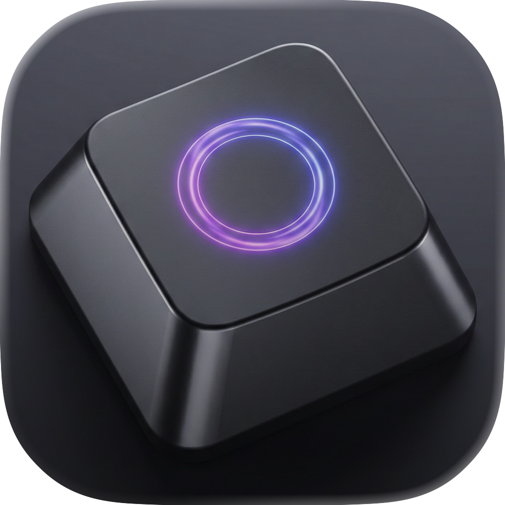
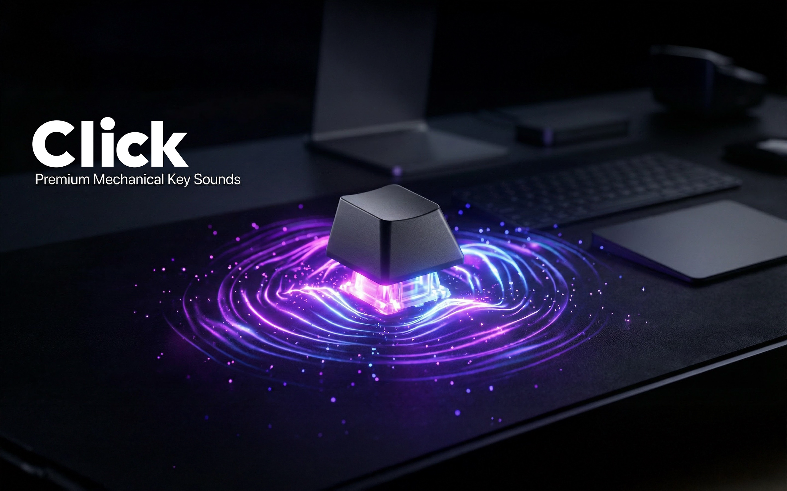

#  Click: Mechanical Key Sound

   
  
  
    
  <code>[██████████▒▒▒▒] Processing App Store Approval...</code>
   
  
<b>⚠️ The TestFlight link below is currently LOCKED. It will activate automatically soon.</b>

   

**Bring the satisfying "click-clack" of a vintage typewriter or a high-end mechanical keyboard to your silent Mac!**

Do you miss the tactile and rhythmic sound of a real keyboard? **Click** restores the joy of writing by adding realistic, high-quality audio feedback to every keystroke. Perfect for writers, coders, and ASMR enthusiasts.

---

## 🚀 Join the Public Beta (TestFlight)

We are inviting keyboard enthusiasts to test the latest version of **Click** before it hits the App Store. No sign-up forms, no waiting.

### 👉 [Download Beta via TestFlight](https://testflight.apple.com/join/x4HuHaJb)

*(Requires macOS 11.0 or later)*

---

## ✨ Key Features
* **Real Mechanical Sounds:** High-quality Blue Switch & Retro Typewriter samples.
* **Zero Latency:** Optimized for real-time audio response while typing.
* **Privacy Focused:** Runs in a sandbox environment; we do not log your keystrokes.
* **Menu Bar App:** Lives quietly in your menu bar, easy to toggle on/off.

---

## 🐛 Feedback & Bug Reports
Found a bug or have a sound request? Help us make **Click** better!

1.  Go to the **Issues** tab above.
2.  Click **New Issue**.
3.  Let us know what you think!

---
*Developed with ❤️ for the macOS Community.*
